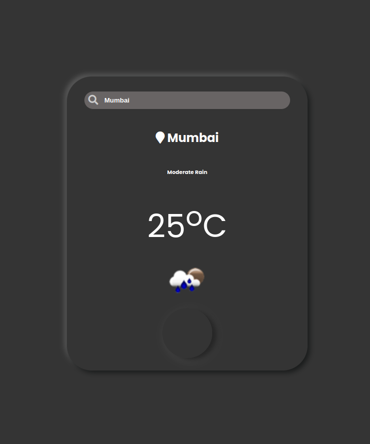

# <a href="https://a07k.github.io/Project-Weather_App/">Weather App</a>

  <h2>Description</h2>
    
This is a simple, user-friendly weather application that allows users to check the current weather conditions for any city. It uses the OpenWeatherMap API to fetch real-time weather data.

  <h2>Features</h2>
    <ul>
        <li>Search for weather by city name</li>
        <li>Displays current temperature in Celsius</li>
        <li>Shows weather description and icon</li>
        <li>Responsive design for various screen sizes</li>
        <li>Refresh button to update weather data</li>
    </ul>

  <h2>Technologies Used</h2>
    <ul>
        <li>HTML5</li>
        <li>CSS3 (api.css file)</li>
        <li>JavaScript (inline in HTML file)</li>
        <li>OpenWeatherMap API</li>
        <li>Font Awesome for icons</li>
        <li>Google Fonts (Poppins)</li>
        <li>Bootstrap (for additional styling and responsiveness)</li>
    </ul>

  <h2>Setup</h2>
    <ol>
        <li>Clone or download the repository</li>
        <li>Ensure you have an internet connection (for API calls and external resources)</li>
        <li>Open the HTML file in a web browser</li>
    </ol>

  <h2>Usage</h2>
    <ol>
        <li>Enter a city name in the search bar</li>
        <li>Press Enter or click the search icon</li>
        <li>View the displayed weather information</li>
        <li>Click the refresh button to update the weather data</li>
    </ol>

  <h2>API Key</h2>
    
This app uses an OpenWeatherMap API key. For security reasons, it's recommended to keep your API key private. In a production environment, consider using environment variables or a backend service to secure your API key.

  <h2>File Structure</h2>
    <ul>
        <li>index.html (main HTML file with inline JavaScript)</li>
        <li>api.css (custom styles for the app)</li>
    </ul>

  <h2>Future Improvements</h2>
    <ul>
        <li>Add more weather details (humidity, wind speed, etc.)</li>
        <li>Implement geolocation for automatic local weather</li>
        <li>Add a forecast feature for upcoming days</li>
        <li>Improve error handling for invalid city names</li>
        <li>Separate JavaScript into its own file for better organization</li>
    </ul>

  <h2>Credits</h2>
    <ul>
        <li>Weather data provided by OpenWeatherMap API</li>
        <li>Icons by Font Awesome</li>
        <li>Fonts by Google Fonts</li>
    </ul>

  <h2>License</h2>
    
This project is open source and available under the MIT License.

